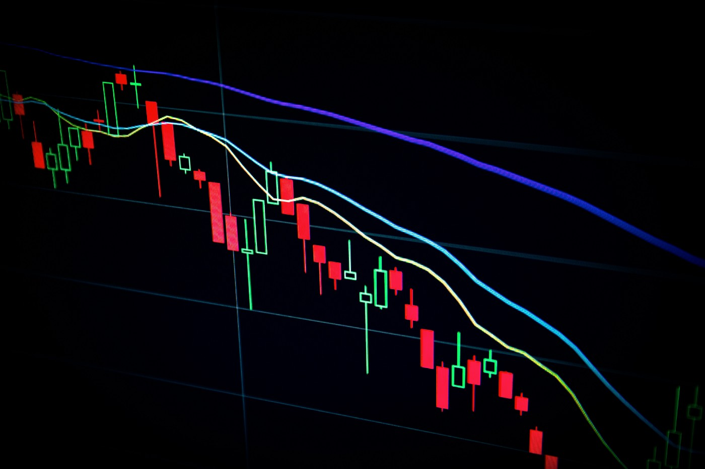

# Data Science Portfolio
---
## Machine learning

### Fraud Detection

Fraud detection is a set of processes and analyses that allow businesses to identify and prevent unauthorized financial activity. This can include fraudulent credit card transactions, identify theft, cyber hacking, insurance scams, and more.(right now it is empty it is just to maintain a website)

---
### Predictiong commodities trends
prediciting the commoditites trend based on the weather patterns, logistics and political situations

</centre>
